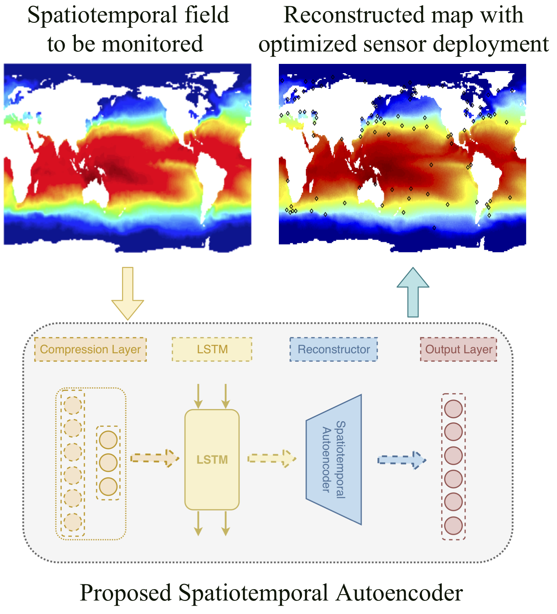

# WSN-SAE


This is the Python+TensorFlow code to reproduce results for paper ['WSN Sampling Optimization for Signal
Reconstruction using Spatiotemporal Autoencoder'](https://ieeexplore.ieee.org/document/9133473).


Due to GitHub file size limitations, datasets are not upload to this repo, you can:
1. Download raw data from [NOAA](https://www.esrl.noaa.gov/psd/data/gridded/data.noaa.oisst.v2.html).
2. Request preprocessed data by sending email to me at jhchen@mech.ubc.ca.


# Getting Started
1. Computing environment set up can be refered to [this repo](https://github.com/JiahongChen/Set-up-deep-learning-frameworks-with-GPU-on-Google-Cloud-Platform). 
2. Required pacakes
```tensorflow, pandas, numpy, scipy, argparse```.
3. Download data and place it at './Data' folder.
4. Run the code by
```
bash batchrun.sh
```
5. Results will be stored at './results' folder.

# Citation
Please cite our paper if you use our code for your work.
```
@article{chen2019optimization,
  title={WSN Sampling Optimization for Signal Reconstruction using Spatiotemporal Autoencoder},
  author={Chen, Jiahong and Li, Teng and Wang, Jing and de Silva, Clarence W},
  journal={IEEE Sensors Journal},
  year={2020},
  volume={},
  number={},
  pages={1-1},
}
```
